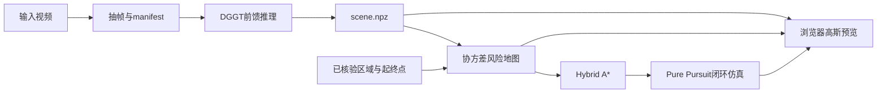

# 算法与工程实现

## 1. 系统边界

主输入是一段视频和前馈模型输出。项目先抽帧，再调用 DGGT bridge（或用户提供的 Splatt3R/外部命令），将模型输出统一成米制 `scene.npz`；随后从高斯构建占据风险图，用 Hybrid A* 搜索满足车辆运动学的路径。传统栅格 A* 仍保留为可选对照，旧的静态 COLMAP + per-scene 3DGS 训练链路也保留为对照。

合成模式从程序生成的 scene 开始，跳过视频和前馈推理，仅验证 scene → map → A* → control → UI。没有把合成高斯说成真实视频重建结果。

### 前馈重建适配层

`parking_gs/feedforward.py` 负责视频解码、外部命令隔离和输出归一化。默认 DGGT 路径调用 `scripts/dggt_export_scene.py`：该 bridge 动态加入 `third_party/dggt`（也支持 `--repo` 指定其他 checkout），加载 `VGGT` checkpoint，读取连续帧，取预测深度/位姿生成世界点，再用 DGGT 的 `gs_map`、动态置信度和静态掩码导出颜色、透明度、尺度、四元数与位置。它不会下载权重。

DGGT 原始仓库面向 Waymo/nuScenes/Argoverse2 的目录结构；本工程 bridge 对普通视频提供最小图像序列入口，默认只处理第一段 `sequence_length` 窗口，并在报告中保留这个限制。要覆盖长视频，需要在窗口之间做位姿对齐后再融合，当前不把互不一致的窗口直接拼接。

Splatt3R 官方模型是未标定图像对的前馈重建，不是长视频全局地图模型。项目接受 `--backend splatt3r --command ...`，要求该命令把所有图像对对齐到同一世界坐标后写出一个 PLY/NPZ；如果只逐对生成局部 PLY 而不做对齐，适配器会拒绝/得到错误地图，不能将局部文件简单拼接。

## 2. 坐标约定

- 世界：米制、Z 向上、地面 z=0。
- 相机：OpenCV X 向右、Y 向下、Z 向前。
- 位姿：`[x,y,yaw]`，yaw 从 +X 逆时针，单位弧度。
- 车辆参考点：后轴中心。轴距 2.65 m，宽 1.8 m，后轴至前保险杠 3.55 m，至后保险杠 0.9 m。
- 四元数：wxyz，协方差 `Σ = R diag(s²) Rᵀ`。
- `scene.npz` 中尺度为正值、颜色与透明度为激活后的 0–1 值，与原版 Graphdeco PLY 中的 log-scale/SH 格式不同，不可直接改后缀互换。

## 3. 重建

优化参数为高斯位置 μ、log尺度、旋转四元数、RGB logits 和 opacity logits。每步采样一个训练视角，使用 gsplat 1.5.3 的 `rasterization(..., render_mode='RGB+ED')` 获得 RGB 和期望相机 Z 深度。

损失：

`L = mean(abs(I_render - I_gt)) + λ_depth * mean_valid(abs(D_render-D_gt)) + 0.001*mean(scale)`

深度项仅在提供米制 depth 的帧上启用，且忽略无效深度与 alpha≤0.1 的像素。位置使用较小学习率，其余参数使用统一学习率。四元数每步归一化，log-scale 限幅。每 300 步（前 75% 训练期间）剔除极低透明度高斯，并对梯度较高、尺寸较大的候选复制并扰动增密，遵守最大高斯数。

这是简化、可维护的 3DGS 训练实现：使用 view-independent RGB，相当于不使用高阶球谐方向外观；增密不是原论文完整策略；拓扑改变时重建 Adam 优化器，动量会重置；不包含 SSIM 损失、位姿优化、动态对象分解或多 GPU 训练。适合基线和工程拓展，不宣称达到原版论文质量。

最终导出 scene、损失日志、固定验证视角图和 PSNR。验证图像未参与训练，但相邻帧相关性较强，见数据文档的划分限制。

## 4. 风险地图

首先按高斯 Z 方向 ±2σ 支撑范围与车辆碰撞高度区间 [0.15,2.0] m 是否重叠进行过滤。地面高斯被排除，仍允许低矮物体的支撑进入碰撞层。超出这个高度假设的障碍需要调整实现。

对剩余高斯取 XY 协方差边缘分布：

`C_i = Σ_i[0:2,0:2] + (u² + (resolution/2)²) I`

`risk(x) = max_i opacity_i * exp(-0.5 * (x-μ_i)ᵀ C_i⁻¹ (x-μ_i))`

每个高斯在 3 倍最大主轴标准差范围内局部更新地图。取 max 而非累加，减少大量相关高斯重叠产生的虚假高置信度。这个 risk 是几何启发式分数，**不是经过标定的物理占据概率**。默认分辨率 0.25 m，阈值 0.35，几何膨胀 u=0.12 m。它们都是可调整的研究参数。

已知区域来自人工核验 polygon。障碍由风险图判定；polygon 外无论风险值如何一律不可通行。纹理缺失或观测遗漏仍可能导致 polygon 内漏检，不能据此作实车安全保证。

## 5. 碰撞检测

使用带 margin 的有向车辆矩形，先检查车身四角是否越过地图边界，再取车身包围盒内的占据/未知栅格，将栅格中心投影到车身轴线。将半栅格投影尺寸加入矩形边界，保守判定可能交叠的格子。该测试可能因栅格分辨率带来假阳性，不只检查后轴点或车身四角。

路径原语和连接曲线按不超过约 0.1 m 采样检查；控制仿真每 0.1 s 检查下一姿态，默认速度 0.65 m/s，步进约 0.065 m。没有连续扫掠体数学保证，也不支持动态障碍预测。

## 6. 规划

默认规划器是 `parking_gs/planner.py` 的 Hybrid A*。连续状态为 `(x,y,yaw)`，节点键还包含行驶方向和上一转向档位；每个扩展使用自行车运动学积分，尝试前进/倒车与五个离散转角，并在每个子步做车辆轮廓碰撞检测。代价包含距离、倒车、换挡、转向变化和风险。

搜索过程中会尝试 LSL/RSR/LSR/RSL CSC 曲线连接，以便精确接近目标。默认限制 35,000 个展开节点、25 秒。未知空间和占据风险都不可通行，闭环控制再次检查碰撞，发生偏差时停车。`parking_gs/astar.py` 是传统 8 邻域栅格 A* 对照实现；HTTP API 的 `planner` 字段可传 `astar` 显式切换，默认值是 `hybrid`。

## 7. 控制和指标

按规划方向将轨迹分段，Pure Pursuit 基于当前仿真位姿计算转角。倒车直接使用带符号速度的后轴运动学；接近段末尾降低速度，换挡处记录零速帧。每步重新检查车辆碰撞，若不满足则输出 collision_stop 并保持最后安全位姿。

到达最终轨迹段后，位置误差小于 0.5 m、航向误差小于 0.15 rad 标为 parked。该状态依据目标后轴位姿，不额外证明车辆完全落在用户任意配置的车位多边形内；默认演示目标按车辆长度放在车位内部。控制器具有几何简化：不包含转向速率、加速度限制、轮胎侧滑、执行延迟、传感器噪声或真实定位。

输出 status、位置/航向误差、行驶距离、换挡次数、仿真时长及完整轨迹。碰撞停车、超时、终点误差超限都是独立失败状态。

## 8. 前端渲染

Canvas 2D 实现高斯近似光栅化：透视投影中心，使用投影 Jacobian 将世界协方差转换到二维，求主轴后画高斯透明椭圆，按相机深度从远到近混合。它展示完整协方差的影响，不只是等大点云。

这是预览实现：渐变离散近似高斯核、中心深度排序、最多抽样 12,000 个高斯、视角无关 RGB。它不是 gsplat CUDA 渲染的逐像素等价实现，也不保证大规模场景实时。BEV 绘图与点击反算共享米制变换；规划使用全量高斯而不是显示抽样。
